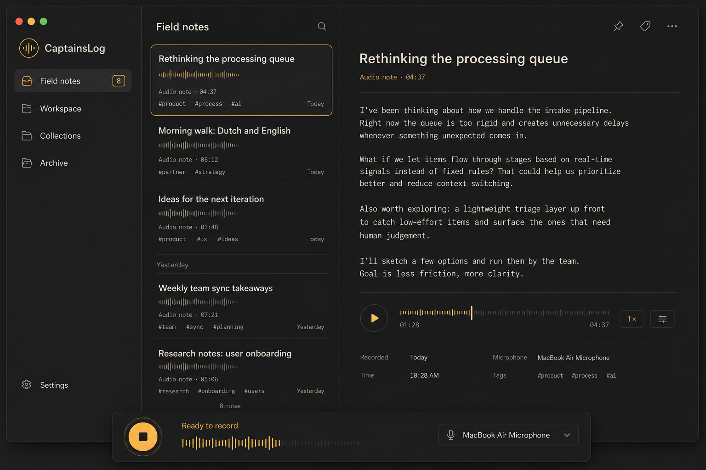
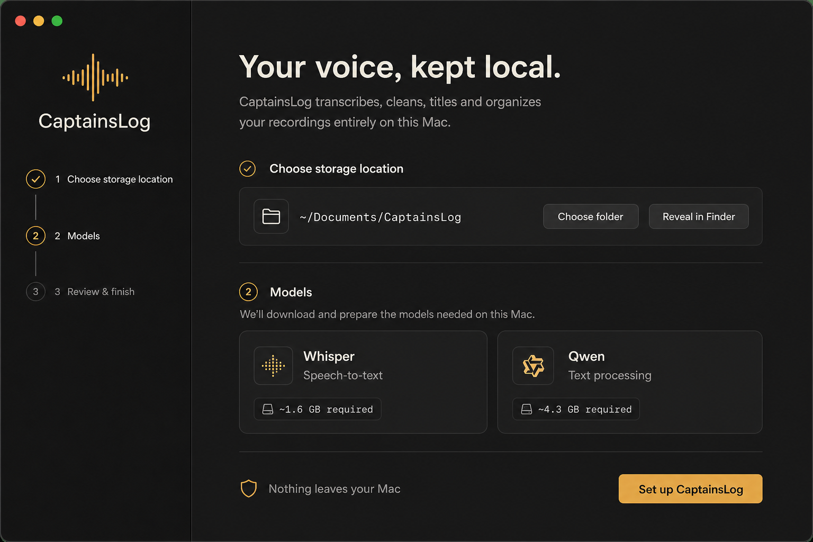
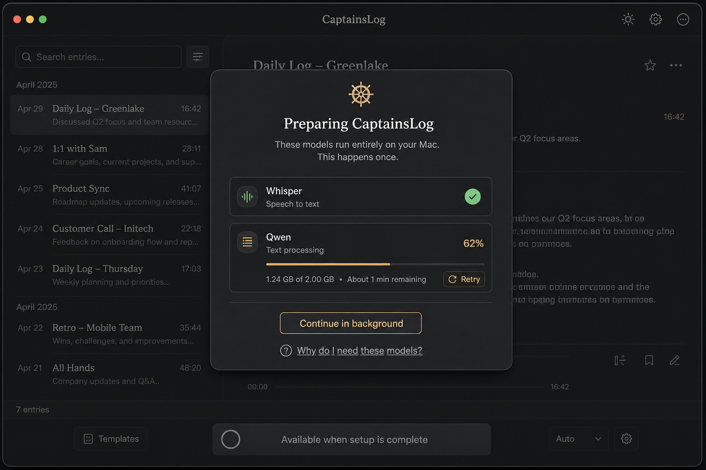
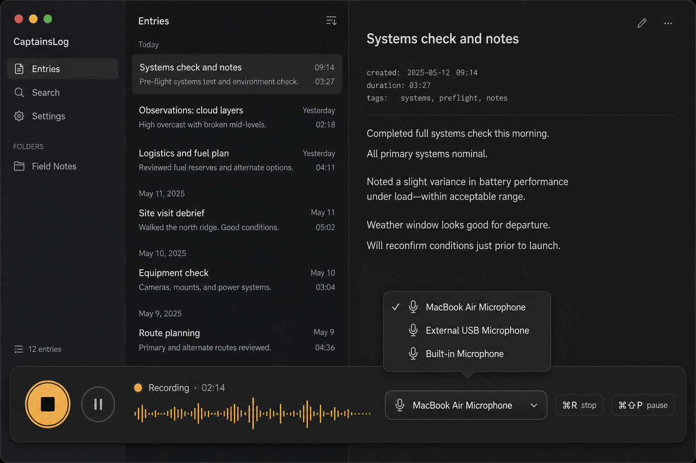
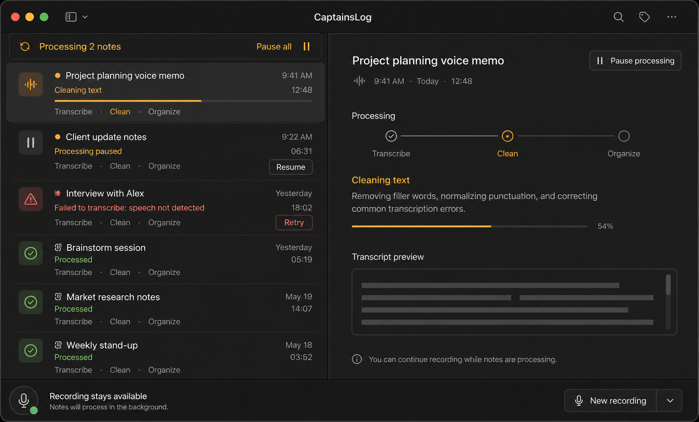
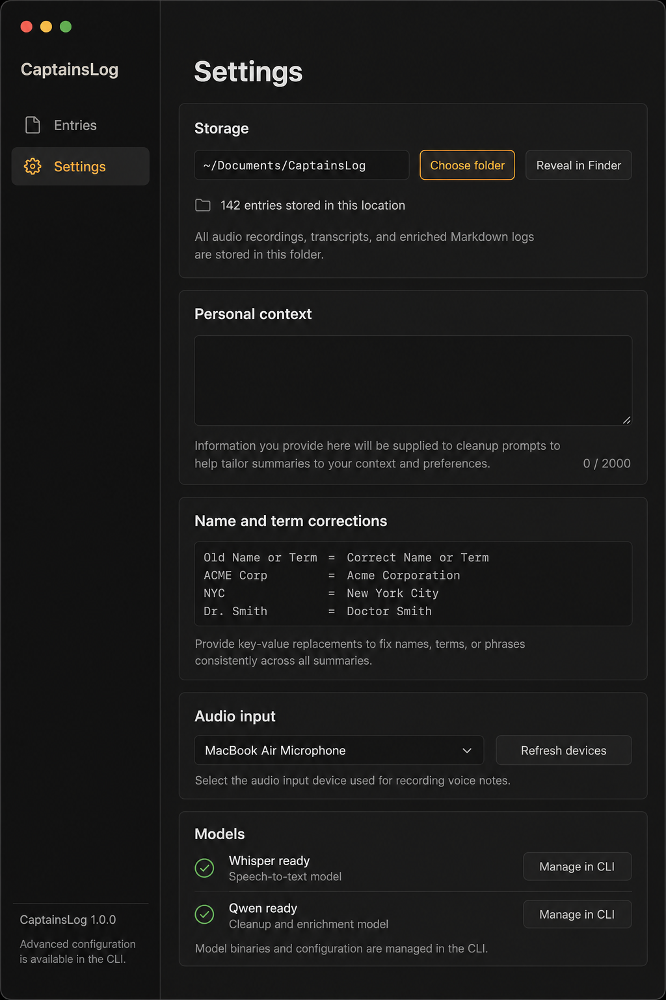
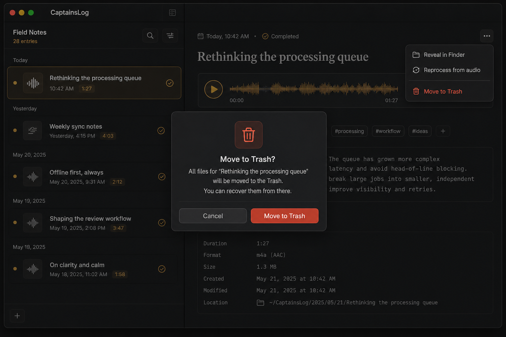

# CaptainsLog — Logs design system

## Intent

Logs is a dark, local-first desktop interface for turning spoken thoughts into useful Markdown entries. It should feel like a well-made independent tool: calm enough for daily reflection, exact enough for people who enjoy understanding their tools.

The character comes from audio-native details—waveform rulers, precise time stamps, compact mono metadata, and a warm amber recording signal—not from themed decoration. It is deliberately **not** a Star Trek or LCARS system: no elbows, stardates, segmented command bars, hardware telemetry, or multiple competing accent colours.

### Product principles

1. **Voice is the primary action.** Recording is always available, visually stable, and can continue while prior entries process.
2. **Notes are human first.** Show natural titles and useful summaries. Filenames, pipeline stages, and paths are supporting detail.
3. **Local is reassuring, not performative.** Explain on-device processing at setup and model preparation; do not repeat technical specs across the workspace.
4. **Technical detail is earned.** Durations, waveforms, timestamps, tags, and paths appear when they help people scan, review, or recover work.
5. **Status is quiet until it matters.** Completed work uses a small moss indicator. Amber means active audio/work. Rust means recovery or deletion.
6. **One job per surface.** The workspace is for reviewing entries; the recording dock is for capture; settings is for preference editing; modal dialogs are for irreversible decisions.

## Visual foundations

### Colour roles

These are semantic roles, not a requirement to use exact RGB values. Start from these values when implementing, then test in the native SwiftUI colour environment.

| Token | Suggested value | Use |
| --- | --- | --- |
| `canvas` | `#0D0E0D` | Window background |
| `surface` | `#161715` | Sidebar, dock, modal base |
| `surface-raised` | `#1C1D1B` | Cards, selected rows, menus |
| `stroke` | `#30312E` | Quiet dividers and outlines |
| `text-primary` | `#F1EEE7` | Titles and primary controls |
| `text-secondary` | `#B8B5AD` | Summaries and supporting copy |
| `text-tertiary` | `#85847E` | Timestamps and inactive metadata |
| `amber` | `#F5B544` | Record, active audio, focus, primary action |
| `amber-muted` | `#B88937` | Waveform detail and selected-row outline |
| `success` | `#8FBD78` | Completed processing |
| `danger` | `#D96859` | Failure, retry emphasis, destructive confirmation |

Amber is intentionally scarce: one primary action per screen and active audio/progress only. Do not use it for navigation, completed state, and decoration simultaneously.

### Typography

- **UI/body:** SF Pro (native) or Inter if the product later needs a bundled cross-platform face. Use regular/medium weights; avoid condensed all-caps as the default voice.
- **Editorial note title:** a restrained serif may be used for selected-entry content or section headings, but never in dense lists. This gives long-form notes a personal, considered quality without weakening utility.
- **Metadata:** SF Mono / JetBrains Mono at 11–12 pt. It carries time, duration, paths, stage names, and tags.
- **Scale:** 28–32 pt page title; 22–26 pt note title; 15–17 pt list title; 13–15 pt summary; 11–12 pt metadata. No required information may be smaller than 11 pt.

### Spacing, shape, and depth

- Use a 4 pt spacing unit: 8, 12, 16, 20, 24, 32, 40.
- Default controls use 10–12 pt corner radii; recording docks and major panels use 18–24 pt. Avoid pills except for concise tags or status tokens.
- Separate surfaces with thin strokes first. Use very soft shadows only for floating docks, menus, and dialogs.
- Rows rely on alignment, whitespace, and dividers—not box-on-box card stacks.

### Signature motif: the audio ruler

The waveform is the identity system. Render it as a thin sequence of vertical ticks rather than an illustration.

- Inactive: low-contrast graphite ticks.
- Active/recording: amber ticks with amplitude from the microphone level.
- Played/completed: amber leading ticks, quiet trailing ticks.
- Keep it 20–28 pt high in lists and 28–40 pt high in playback/recording contexts.

Do not add an audio ruler merely as decoration: it should represent captured audio, playback position, or live signal.

## Layout system

### Shell

The desktop shell has three stable regions:

1. **Navigation rail, 240–280 pt.** App mark, primary destinations, optional collections, settings anchored at the bottom.
2. **Entry list, 320–380 pt when a detail pane is present.** Chronological entries grouped by natural dates.
3. **Reading pane, flexible.** Selected entry text, audio playback, tags, and recovery actions.

At the existing 720 pt minimum window width, collapse to a single list; opening an entry replaces the list with a back affordance. Do not force three columns into a narrow window.

The recording dock is fixed above the bottom edge and never changes the surrounding layout when its state changes. Expanding a device menu overlays the dock; it must not push content.

### Navigation

Use plain-language labels: **Entries**, **In progress**, **Projects** (only when implemented), **Archive**, and **Settings**. The active item has a low-contrast raised surface and an amber icon or short left indicator; do not fill whole navigation cells with amber.

The app mark is a compact amber waveform in a circle or rounded square. It is the only brand ornament needed.

## Components and behaviour

### Entry row

An entry row contains, in scanning order:

1. Time or relative date in a fixed mono gutter.
2. Human-readable title.
3. One or two lines of summary, if processing is complete.
4. Audio ruler, duration, and up to three tags.
5. A quiet status at the trailing edge: green dot + `Processed`, amber text + active stage, or rust error message.

Use an ellipsis/context menu for secondary actions: Reveal in Finder, Resume/Retry, Reprocess from audio, Move to Trash. Hover may reveal the menu affordance, but it must remain keyboard-accessible.

### Processing stepper

Processing is currently `Transcribe → Clean → Categorize → Name → Enrich`. The UI may present the mental model as `Transcribe → Clean → Organize`, but must expose the current exact stage in accessible text and in the status message.

- Completed: low-key check or neutral line.
- Active: amber dot/line and a sentence explaining what is happening.
- Paused: neutral state with one `Resume` action.
- Failed: rust error with concise message and `Retry`.

The batch queue is a small status strip above entries, not a permanent dashboard.

### Recording dock

The dock has four states and retains its footprint in all of them.

| State | Main control | Label | Secondary control |
| --- | --- | --- | --- |
| Ready | Amber record circle | `Ready to record` | Device selector |
| Recording | Amber stop square | `Recording · mm:ss` + live waveform | Pause |
| Paused | Amber resume/play control | `Paused · mm:ss` | Stop |
| Models unavailable | Disabled control | `Preparing models…` | Progress/help |

Use `⌘R` to start/stop and `⌘⇧P` to pause/resume. Show the shortcut as quiet mono help, never as the primary label.

### Device selector

The selected microphone name is visible in the dock. Clicking opens a 220–280 pt overlay menu above the selector, listing inputs with an icon, name, and one checkmark. Refresh devices belongs in Settings and is not necessary in the dock.

### Settings fields

Use stacked section cards with plain-language helper text:

- **Storage:** folder, entry count, Choose folder, Reveal in Finder.
- **Personal context:** long text area, 2,000-character counter, explicit note that it informs cleanup.
- **Name and term corrections:** multiline source → replacement rules, with a small example.
- **Audio input:** selected device and Refresh devices.
- **Models:** readiness only. The current app manages model paths and identifiers through the CLI, so the UI must point there rather than imply unsupported in-app editing.

## Screen reference set

These screenshots are conceptual references, not implementation screenshots. The app already implements entry search and selected-entry detail alongside the list, processing controls, recording, device selection, onboarding, deletion, and settings. Audio playback and project collections remain planned. Some images show illustrative paths, counts, device names, or version text; review them before publishing as product screenshots.

### 1. Main workspace — selected entry

The reference for day-to-day review: navigation, chronology, focused reading, and a permanent capture dock coexist without competing. Treat details beyond current app behavior as design direction.

### 2. Onboarding — local storage and prerequisites

Onboarding makes the local-first value explicit once, asks for the data directory, and frames models as a simple setup requirement rather than a mysterious technical task.

### 3. Model preparation

The preparation overlay blocks recording honestly, communicates individual model progress, and offers a retry route. Avoid hiding model failures behind a generic disabled record button.

### 4. Recording and input selection

Recording is the most saturated state. The waveform communicates live input, stop and pause are unambiguous, and selecting a microphone is an overlay action with no layout shift.

### 5. Processing and recovery

The processing screen makes background work legible without turning the application into a pipeline monitor. It shows active progress, paused work, a retryable error, and the fact that recording remains available.

### 6. Settings

Settings turns the current flat sections into durable preference cards while preserving the existing storage, context, corrections, device, and CLI model-management boundaries.

### 7. Entry management and safe deletion

Destructive work uses a confirmation dialog that names the entry, states that all related files move to Trash, and clearly distinguishes Cancel from the rust-red confirmation.

## Accessibility and interaction requirements

- Meet WCAG AA contrast for all text and action labels. Test amber on dark surfaces and rust error text in particular.
- Never use colour alone for process state: pair it with text, an icon, or both.
- Preserve keyboard focus rings in amber; do not rely on hover for actions.
- Respect Reduce Motion: waveform animation becomes a static/periodic indicator and dock transitions use opacity only.
- Maintain fixed dock and list geometry across recording, paused, processing, and model-loading states. Use opacity/overlays rather than conditional insertion where layout would jump.
- Destructive controls should never be adjacent to everyday actions without a divider and danger colour.

## Implementation boundary

This document defines the target experience, not a claim that every pictured element exists today. The current codebase already provides:

- first-launch data-folder setup;
- Whisper and Qwen readiness/download state;
- recording, pause/resume, input-device selection, and level metering;
- resumable processing, batch resume, individual retry, and reprocess;
- entry summaries/tags/date grouping, Finder reveal, and Trash-based deletion;
- storage, personal context, and correction settings.

Planned work implied by the reference set: audio playback and richer collections. Search and selected-entry detail are implemented; continue to verify those interactions during native UI acceptance.
