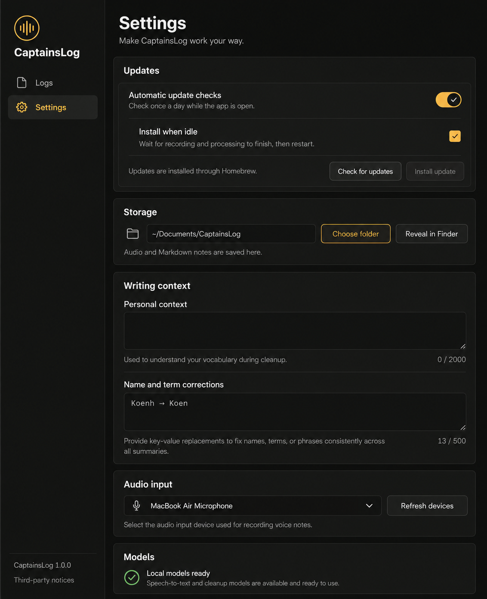

# Settings control redesign

Generated with the built-in ImageGen tool. This is a design reference, not a
product screenshot. The SwiftUI implementation preserves actual preferences,
statuses, and field behavior; illustrated version numbers and character limits
are not product requirements.

## Direction

Use the existing graphite surfaces, warm white SF Pro text, and amber accent.
Move Updates to the top, put headings inside section surfaces, and combine
personal context and corrections under Writing context. Keep supporting paths in
SF Mono. Place storage actions below the path so they fit narrow window widths.

Give automatic checks a compact switch with a dark thumb and an explicit checked
state. Give the dependent install preference a square checkbox. Preserve native
Toggle semantics, keyboard operation, focus, disabled state, and Reduce Motion.
Each preference has a short description and a full-row click target. Reserve
status space so changing update messages never moves the following sections.

The image contains a nested border in Updates; the implementation removes that
extra border to keep the rows quiet. Character counts show actual counts, without
invented maximum lengths. Audio input remains informational with Refresh devices.

## Generation prompt

Use case: ui-mockup. Asset type: high fidelity macOS desktop Settings design reference for CaptainsLog, a local voice memo and Markdown logs app. Input image is a style reference only, not an edit target. Redesign the settings page preserving graphite/amber independent native Mac app identity. Produce one polished flat front-on screenshot, approximately 1100 by 1350 pixels, no desk, device frame, perspective or floating UI. Left sidebar ~220px has waveform circle mark, CaptainsLog, Logs, selected Settings. Main content left aligned with generous but efficient spacing, title Settings and subtitle 'Make CaptainsLog work your way.' Native SF Pro type, warm off-white text #F1EEE7, secondary #B8B5AD, background #0D0E0D, sidebar #161715, raised surfaces #1C1D1B, thin borders #30312E, accent #F5B544, quiet moss ready indicators #8FBD78. Group headings inside surfaces, avoid box-on-box stacks. Most important first section 'Updates': prominent full-width preference row 'Automatic update checks' with description 'Check once a day while the app is open.' and a beautifully crafted compact custom ON toggle at the trailing edge: 42x24 amber capsule track, dark circular thumb with a tiny light checkmark, subtle crisp stroke. Beneath a divider, slightly indented row 'Install when idle' with description 'Wait for recording and processing to finish, then restart.' and a trailing 20px custom rounded square amber checked checkbox. This is a dependent preference visually quieter than the main toggle. Below it quiet status 'Updates are installed through Homebrew.' plus two compact neutral buttons 'Check for updates' and 'Install update'; latter disabled. Second section 'Storage' includes folder icon, illustrative '~/Documents/CaptainsLog' path in a dark recessed field, outline 'Choose folder' and neutral 'Reveal in Finder' buttons, helper 'Audio and Markdown notes are saved here.' Third section 'Writing context' contains 'Personal context' with a textarea and helper 'Used to understand your vocabulary during cleanup.' and 'Name and term corrections' with another shorter textarea illustrative 'Koenh → Koen'. Lower compact horizontal sections 'Audio input' with microphone device and 'Refresh devices', then 'Models' with ready indicator and 'Local models ready', then quiet footer version and Third-party notices. Keep actual content plausible and grounded in those implemented controls. All controls distinct and precise, calm and restrained, focus on well-made checkbox and switch rather than decorative visuals. No gradients, faux telemetry, all caps labels, LCARS decoration or added fictional preferences. Do not imply save button; preferences save automatically.

## Verification

- `swift build`: passed without warnings.
- `swift run run-tests --unit`: 138 passed, zero failed.
- `git diff --check`: passed.
- `CAPTAINSLOG_UI_SKIP_BUILD=1 bash scripts/test-ui.sh eval-settings`: assembled
  an isolated app with repository fixtures, but LaunchServices rejected launch
  with `kLSNoExecutableErr` (-10827). The native UI connector also failed to
  initialize its kernel assets. A live Settings screenshot and keyboard/VoiceOver
  interaction check could not be completed in this environment.

On a working native UI session, inspect the Settings fixture at the 720 pt minimum
window width and at wider widths. In an installed app, verify the enabled switch,
off switch, checked and unchecked install preference, disabled dependency, Tab
focus, Space activation, and Reduce Motion. Update preferences retain their
existing config bindings and install safety guards.
